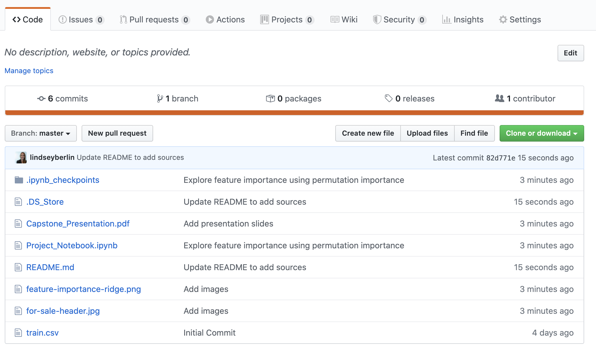
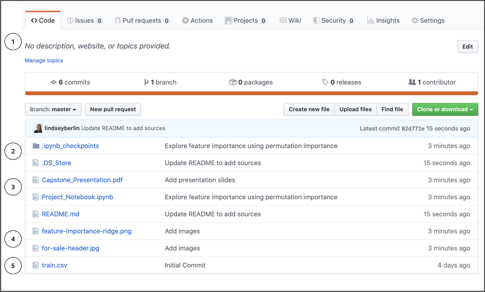
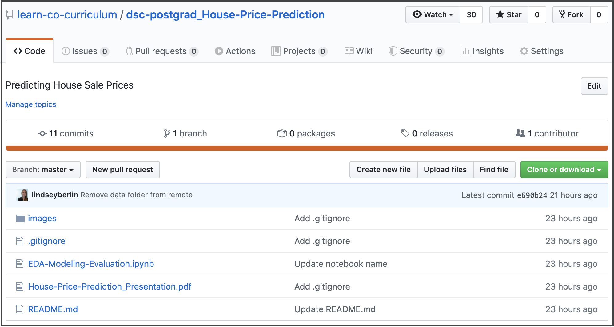

# Repository Problems

In this lesson you will:

- Identify key issues within an example data science project repository
- Review industry standards and employer expectations for project organization

Over the course of a project the structure of a repository evolves. By the end of the project, you need to pause and review your repository to align it with employer expectations.

### Typical Repo
Here is a picture of a typical data science project repository. Take a moment to review it and see if you can identify five aspects that could be improved:

### Issues Identiftied

The issues are identified in the picture below.

#### Issues List:

1. No project description 
2. No `.gitignore` file , so unwanted files such as `.DS_Store` and `.ipynb_checkpoints` are included
3. Non-descriptive names for the presentation, notebook and data file
4. Images are at the same level as the rest of the repository, instead of inside an image folder
5. Data is included in repo instead of in a data folder (or not provided in repo at all)

[Cookie Cutter Data Science](https://drivendata.github.io/cookiecutter-data-science/#directory-structure) is a great resource to guide how you structure a repository. At the end of the reorganization, the cleaner project repository will look like this:

A combination of Git & bash commands, along with some thoughtful renaming through GitHub's platform, will fix a messy repository. Please fork and clone the [messy repository example](https://github.com/learn-co-curriculum/dsc-postgrad_Project-Repository) if you want to follow along with the steps detailed on your own machine.
